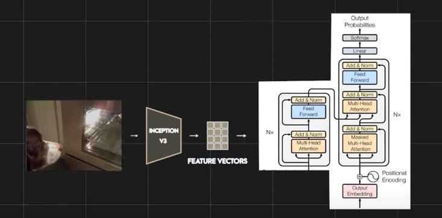

# 🖼️ Image Captioning using CNN + Transformer

## 📌 Objective

This project aims to build and fine-tune an **image captioning system** that automatically generates meaningful textual descriptions for input images.  
It combines **CNN-based feature extraction (InceptionV3)** with a **Transformer-based encoder-decoder** for sequence modeling.

---

## 📂 Dataset

- **Flickr8k dataset** (8,000 images, each with 5 descriptive captions).
- Captions were preprocessed:
  - Lowercased, punctuation removed, extra whitespaces removed
  - Special tokens added: `[start]` and `[end]`

---

## ⚙️ Preprocessing & Data Pipeline

- **Text Vectorization** with TensorFlow (vocabulary size: 10,000, max length: 40).
- **Word ↔ Index mapping** for training & inference.
- **Image Processing**:
  - Resized to `299x299`
  - Normalized to `[0,1]`
- **Data Augmentation**:
  - Random flip, rotation (0.2), contrast (0.3)

---

## 🏗️ Model Architecture

### 🔹 Encoder

- **CNN (InceptionV3, pre-trained)** → extracts image features
- Features reshaped → fed into a **Transformer encoder block**

### 🔹 Decoder

- Transformer-based decoder with:
  - Self-attention (on captions)
  - Cross-attention (on image features)
  - Feed-forward + softmax output

### 🔹 Embedding Layer

- Token embeddings + positional embeddings

📌 **Model Architecture**:  


---

## 🚀 Training

- **Loss Function**: Sparse Categorical Crossentropy (with masking)
- **Optimizer**: Adam
- **Callback**: EarlyStopping (patience = 3 epochs)
- Trained using **TensorFlow 2.x + Keras Subclassing API** on **Kaggle/Colab GPU**

---

## 📊 Results

- **Final Training Accuracy**: 0.4172
- **Final Training Loss**: 2.7210
- **Final Validation Accuracy**: 0.3747
- **Final Validation Loss**: 3.4137

✔️ Model generates **fluent and relevant captions**.  
✔️ Could be improved with **Beam Search, Attention Visualization, fine-tuning CNN, or larger datasets (MSCOCO).**

---

## 📸 Caption Generation

Steps for inference:

1. Load & preprocess input image
2. Extract CNN features & encode
3. Start with `[start]` token
4. Iteratively predict next word (greedy decoding)
5. Stop at `[end]` or max length

Example function:

```python
def generate_caption(img_path):
    ...
    return caption
```

---

## 👨‍💻 Team Members

- **22K-8729** – Sajad Ali
- **22K-4084** – Umar Orakzai
- **22K-8727** – Hasan Abdul Rehman
- **22K-4044** – Muhammad Umar
